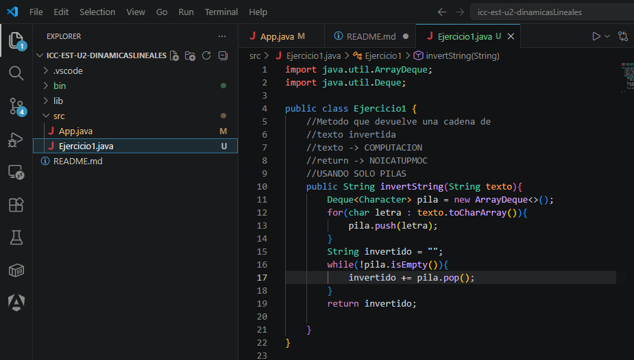
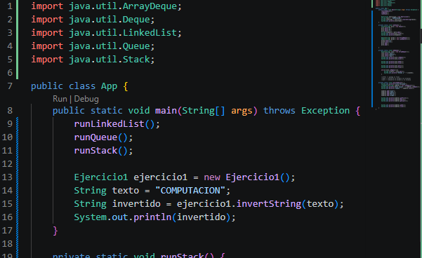

# Practica: Estructuras Dinamicas Lineales

## Datos del estudiante
- Nombre: Axel Gonzalez
- Curso: Estructura de Datos Grupo 1
## 1. Implememtacion de estrcuturas dinamicas lineales
- Fecha: 08/06/2026

Descripcion: 

Se implementaron las siguientes estrcuturas dinamicas lineales: 
- Listas enlazadas con LinkedList
- Pilas con Stack y Deque
- Colas con Queue

Ejercicio 1: Invertir un string utilizando una pila

EVIDENCIAS: 

