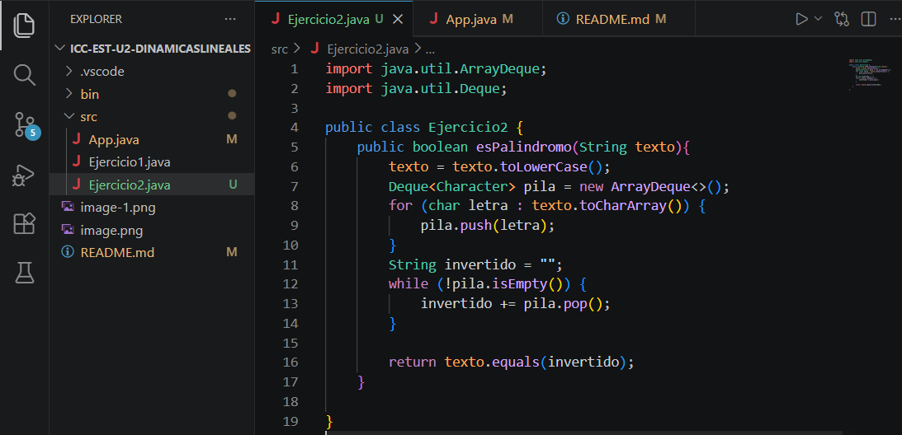
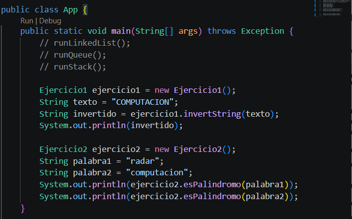
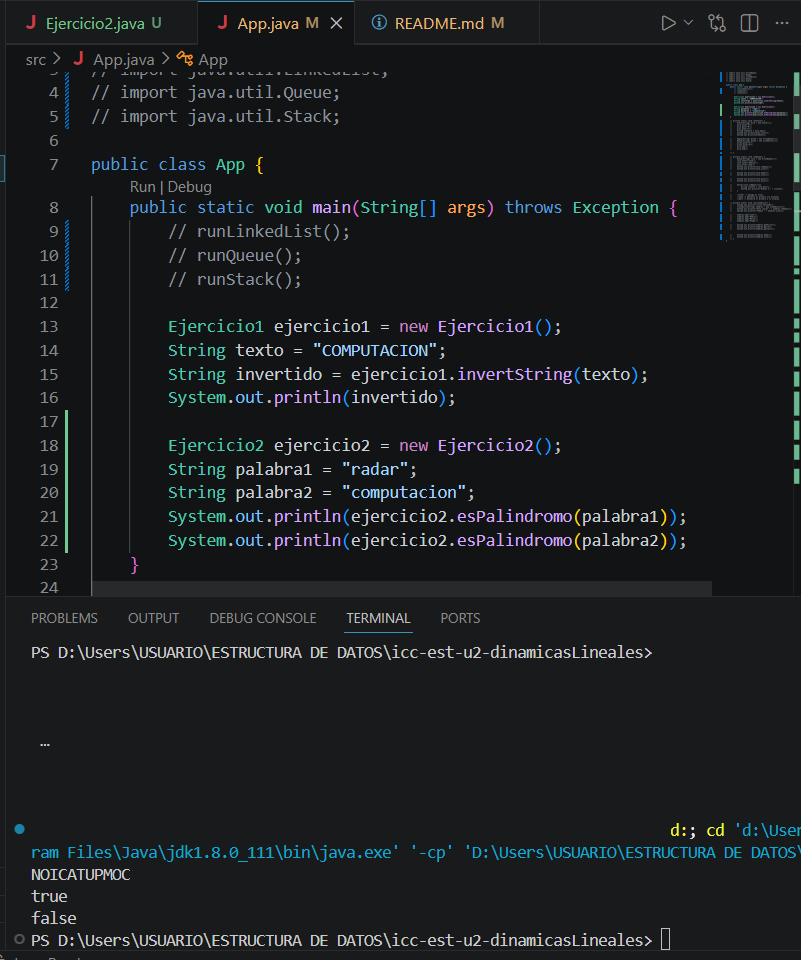

# Practica: Estructuras Dinamicas Lineales

## Datos del estudiante
- Nombre: Axel Gonzalez
- Curso: Estructura de Datos Grupo 1
## 1. Implememtacion de estructuras dinamicas lineales
- Fecha: 08/06/2026

Descripcion: 

Se implementaron las siguientes estrcuturas dinamicas lineales: 
- Listas enlazadas con LinkedList
- Pilas con Stack y Deque
- Colas con Queue

Ejercicio 1: Invertir un string utilizando una pila

EVIDENCIAS: 

## 2. Ejercicio Palíndromo
- Fecha: 10/06/2026

Descripcion: 

En el ejercicio 2 se utilizo un metodo que verifica si una palabra es palindorma usando una pila. Primero se pasa el texto del parametro a minusculas para que palabras como Radar tambien sean reconocidas correctamente, luego se apilan todos las letras para obtener el texto invertido, despues de compara si el texto original y el invertido son iguales para determinar si la palabra es palindroma

Ejercicio 2: Saber si una palabra es palindroma

EVIDENCIAS: 

## 3. SALIDA EN CONSOLA DE AMBOS EJERCICIOS

